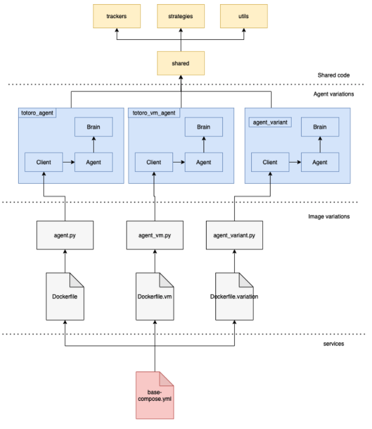
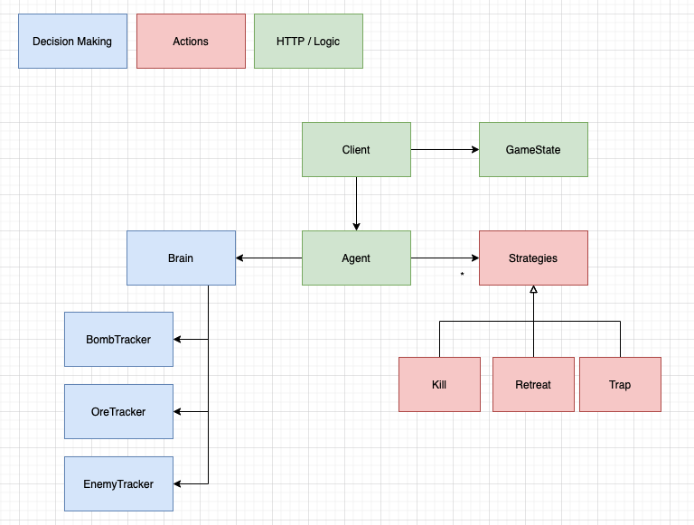

# AI Sports Coder One

## Purpose
This is the code base for the submission for the 2021 AI Sports event. For more information, please visit:

https://www.gocoder.one/aisports

## Prerequisites

- Python3
- Docker

## Getting started

1. Clone the repository

    ```
    git clone https://github.com/chrisrabe/ai-sports-2021.git
    ```

2. Set up workspace

   ```
   docker-compose up
   ```
   
## Architecture

## High-level architecture



## Architecture for each agent



Agent is separated into three categories:
- Actions
- Decision making
- HTTP and logic

**Decision Making** scripts are responsible for determining the next strategy
that the bot will execute. The "Brain" script will return a *string* value representing
the strategy name.

**Actions** scripts (also called Strategies) contain logic on the actions the bot will
take next. It's usually a single action or sequence of actions that are placed into an
action queue.

**HTTP and logic** scripts are responsible for orchestrating the inputs and outputs of
the decision making and action scripts, as well as handling the send-and-receive logic.

## Contributing

1. Switch `develop`
2. Create a new branch (`git checkout -b <branch-name>`)

Note: Pushes to `master` and `develop` branches can only be through pull requests

Only need to modify the files inside `python3/totoro_agent`. If you're working on decision making
logic, modify the `brain` directory. If you're modifying or adding new actions or strategies, modify
the `strategies` directory. Shared functions or constants are placed inside the `utils` folder.